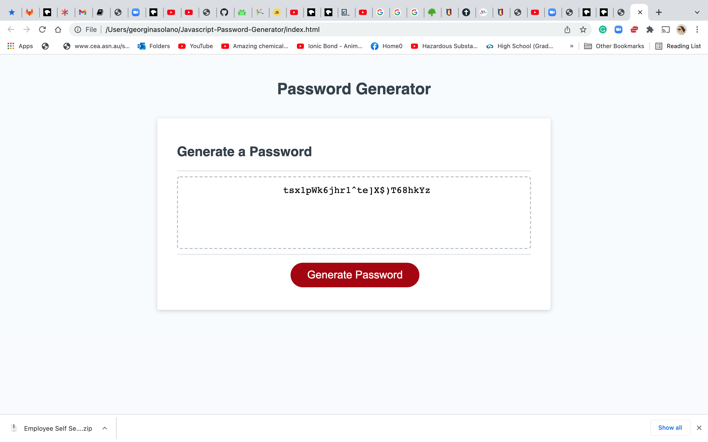

# Javascript-Password-Generator
Homework - Week 3 Javascript code for Password Generator

The purpose of the projects was to creat the javascript code that would 
allow for password to be generated which met the users required length and 
character types required to be included.

Included is the link to the Password Generator:

https://georginasolano.github.io/Javascript-Password-Generator/

In order to achieve the working code, this includes an addEventListener which calls the functions which generated the password when the user clicks the button.

Though the use of Prompts the user indicated the :
* required length of the password;
* the characters to be included in the password, uppercase, lowercase, numeric or special characters. 
* a variable holds the character set chosen by the user, and this is then used as the set from which the password is generated using a random number generator.
* a check is done to ensure that the password lenght selected is within the specified range, otherwise the user is prompted again.
* another check is done to ensure that the user has selected a charater set to be included in the password, otherwise the user is prompted to try again.

Once completed the Generated password is displayed in the display box as seen in the image below.

